# CitiBikeRL: A Technical Report

A reinforcement-learning study of small-scale, station-level bike rebalancing using one calendar year of real Jersey City Citi Bike trip data, daily NOAA weather, and U.S. federal holiday context. This document is a self-contained technical exposition: it describes the MDP, the data pipeline, all policies, the training and evaluation procedures, the engineering infrastructure, and a critical analysis of every quantitative result the repository contains.

---

## 1. Problem Statement

Bike-share systems suffer when local station inventories drift away from local demand. An empty origin station produces unmet demand (a customer who wanted a bike but found none); a full destination station produces overflow (a customer who wanted to dock but couldn't). System operators rebalance by physically transferring bikes between stations.

The rebalancing decision is fundamentally sequential: moving bikes now changes future inventories and therefore future served / unmet trips. Each move also costs labor, fuel, and station capacity. The natural framing is a Markov Decision Process whose state is the (time, calendar context, inventory) tuple, whose actions are inter-station bike transfers, and whose reward trades served trips against unmet demand, movement cost, and overflow.

This project studies a deliberately compact instance of that MDP — five high-activity stations, hourly time resolution, one-day episodes — so that tabular methods are tractable, neural-net training is fast, and rigorous chronological evaluation is feasible. The research question is whether a learned policy can beat a strong, demand-aware heuristic on a strict future-month holdout.

The short answer (full evidence in §10–§12): **no, not reliably**. The heuristic captures most of the available signal; tabular Q-learning either reduces to the heuristic via fallback or degrades when forced to act on its own values; and a dueling Double DQN gives mean reward 117.25 ± 4.18 across 8 seeds versus heuristic 122.45, with 1/8 seeds beating the heuristic.

### 1.1 System overview at a glance

```mermaid
flowchart LR
    subgraph DATA["Data sources"]
        A1[Citi Bike S3<br/>14 monthly ZIPs<br/>Jan 2025 – Feb 2026]
        A2[NOAA NCEI API<br/>USW00014734<br/>daily weather]
        A3[US Federal<br/>Holiday Calendar]
    end
    subgraph PIPE["Preprocessing"]
        B1[Schema<br/>validation]
        B2[Hourly OD-flow<br/>aggregation]
        B3[Demand-tensor<br/>construction<br/>423 days × 24 h × 5 stations]
    end
    subgraph MDP["MDP environment"]
        C1[State<br/>inventory + calendar<br/>+ weather]
        C2[Action<br/>21 discrete moves]
        C3[Reward<br/>+served − unmet<br/>− moves − overflow]
    end
    subgraph POL["Policies"]
        D1[NoOp baseline]
        D2[Demand-profile<br/>heuristic]
        D3[Tabular Q<br/>v1..v4]
        D4[NumPy DQN<br/>dueling + double]
    end
    subgraph EVAL["Evaluation"]
        E1[Train: 396 days<br/>Test: 27 days Feb-2026]
        E2[Per-episode metrics<br/>+ summary JSON]
    end
    DATA --> PIPE --> MDP
    MDP --> POL
    POL --> EVAL
```

---

## 2. Repository Layout

```
citibikeRL/
├── configs/                YAML hyperparameter files
│   ├── dataset.yaml        timezone, required raw columns
│   ├── environment.yaml    capacity, inventory, rewards/penalties
│   ├── training.yaml       tabular Q-learning hyperparameters
│   ├── dqn_training.yaml   DQN hyperparameters
│   └── evaluation.yaml     evaluation defaults
├── data/
│   ├── raw/                immutable Citi Bike monthly CSVs (zipped + extracted) + per-file metadata
│   ├── processed/          jc_YYYYMM_hourly_flows.csv
│   └── external/           NOAA daily weather + metadata
├── docs/
│   ├── proposal/           course proposal artifacts
│   ├── report/             reports and outlines (this document lives here)
│   ├── presentation/       slide deck (.md/.pdf/.pptx)
│   ├── notes/              meeting notes, decision log, action items
│   ├── REPOSITORY_GUIDE.md naming + collaboration norms
│   ├── WORKFLOW.md         workflow commands
│   └── STATUS.md           weekly status board
├── notebooks/              EDA (currently 01_data_overview.ipynb)
├── outputs/
│   ├── figures/            *.png training-curve and policy-comparison plots
│   ├── tables/             *.csv per-episode metrics, station summaries, seed sweeps
│   ├── models/             *.json learned Q-tables and DQN weights
│   └── logs/               *_experiment_summary.json metadata for each run
├── references/
│   ├── papers/             reading list
│   ├── datasets/           data-source provenance docs
│   └── figures/            reference diagrams
├── scripts/                CLI entry points (download / preprocess / train / evaluate / plot)
├── src/citibikerl/         implementation package
│   ├── config.py           YAML helper
│   ├── cli.py              build-check helper
│   ├── data/               schema + ZIP/CSV I/O + validation
│   └── rebalancing/        env, policies, training (Q + DQN), serialization, plotting
├── tests/                  41 pytest cases (data, env, Q-learn, DQN, IO, scripts, plots)
├── Makefile                standardized commands
└── pyproject.toml          dependencies (numpy, pandas, matplotlib, pyyaml; pytest+ruff dev)
```

The package is installed editable: `pyproject.toml` declares `package-dir = {"" = "src"}` so `import citibikerl` resolves to `src/citibikerl`. CLI scripts are invoked with `PYTHONPATH=src python scripts/<name>.py …`; the Makefile abstracts this.

---

## 3. Dataset

### 3.0 End-to-end data pipeline

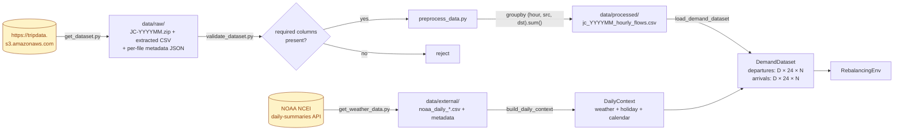

### 3.1 Trip Demand: Jersey City Citi Bike

Source: the official Citi Bike public-trip-data S3 bucket (`tripdata.s3.amazonaws.com`). Each calendar month is a separate zipped CSV named `JC-YYYYMM-citibike-tripdata.csv.zip`. This project uses 14 consecutive months: **January 2025 through February 2026**.

Each raw row is one trip. The schema validated by `scripts/validate_dataset.py` requires:

| column | meaning |
|---|---|
| `started_at` | trip start timestamp (ISO 8601, often UTC offset) |
| `ended_at` | trip end timestamp |
| `start_station_id` | origin station ID (string) |
| `start_station_name` | human-readable origin name |
| `end_station_id` | destination station ID |
| `end_station_name` | destination name |

Required columns and timezone are read from `configs/dataset.yaml`:

```yaml
dataset:
  required_columns: [started_at, ended_at,
                     start_station_id, start_station_name,
                     end_station_id, end_station_name]
  timezone: America/New_York
```

`scripts/get_dataset.py` downloads the URL, extracts the first CSV member if the URL points to a ZIP, and writes both a per-file metadata sidecar and an aggregated `data/raw/_dataset_metadata.json` index with download provenance.

### 3.2 Preprocessing: Raw Trips → Hourly OD Flows

`scripts/preprocess_data.py` aggregates raw trips into hourly origin-destination flow counts:

1. Open the CSV (or first CSV member of a ZIP) via `citibikerl.data.csv_io.open_csv_text`.
2. Validate required columns (`citibikerl.data.validation.missing_required_columns`).
3. Parse each trip's `started_at`, normalize to America/New_York, truncate to the hour.
4. Group `(hour, start_station_id, end_station_id)` and count occurrences.
5. Write a sorted CSV with columns `[hour, start_station_id, end_station_id, trip_count]`.

The output schema is:

| column | meaning |
|---|---|
| `hour` | tz-aware ISO timestamp truncated to the hour |
| `start_station_id` | origin |
| `end_station_id` | destination |
| `trip_count` | number of trips in that hour for that OD pair |

One processed file per month: `data/processed/jc_YYYYMM_hourly_flows.csv`. Multiple processed files can be concatenated by passing them comma-separated to any downstream script.

A subtle integrity check lives in `_extract_expected_year_month` (`src/citibikerl/rebalancing/data.py:264`): if a processed filename matches the canonical `jc_YYYYMM_hourly_flows.csv` pattern, rows whose `hour` does not match `YYYY-MM` are dropped. This guards against contamination when a downstream merge accidentally ingests adjacent-month rows from a monthly file.

### 3.3 Demand Tensor Construction

`load_demand_dataset` (`src/citibikerl/rebalancing/data.py:74`) consumes one or more processed flows and builds the in-memory tensors used by the environment:

- **Episode unit**: one calendar day in the local timezone.
- **Horizon**: 24 hourly steps per episode.
- **Stations**: top-N by total `(departures + arrivals)` activity, ties broken by stable sort. The default N=5; final selection: `JC115, HB101, HB106, JC009, JC109`.
- **Tensors**:
  - `departures`: `(num_episodes, 24, num_stations)` float array of trips originating at each station each hour.
  - `arrivals`: same shape, trips terminating at each station.

For 14 months × ~30 days = **423 daily episodes** at the chosen 5-station subset.

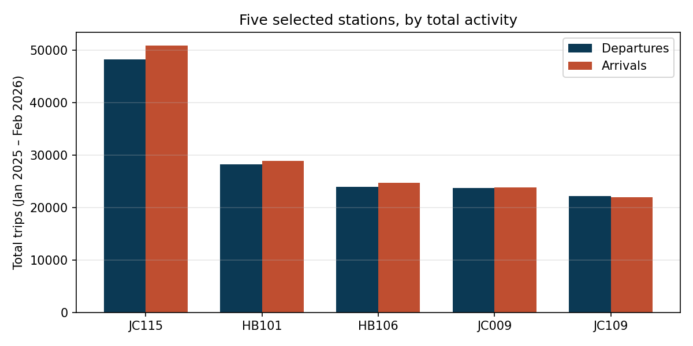

The five stations were chosen by total `(departures + arrivals)` across the full study window. JC115 is the dominant origin/destination by a substantial margin; the remainder are roughly balanced. Both bars use the same trip definition described in §3.1 — a single trip contributes to its origin's `total_departures` and its destination's `total_arrivals`, so a trip whose endpoints are both in the selected set is counted once on each side.

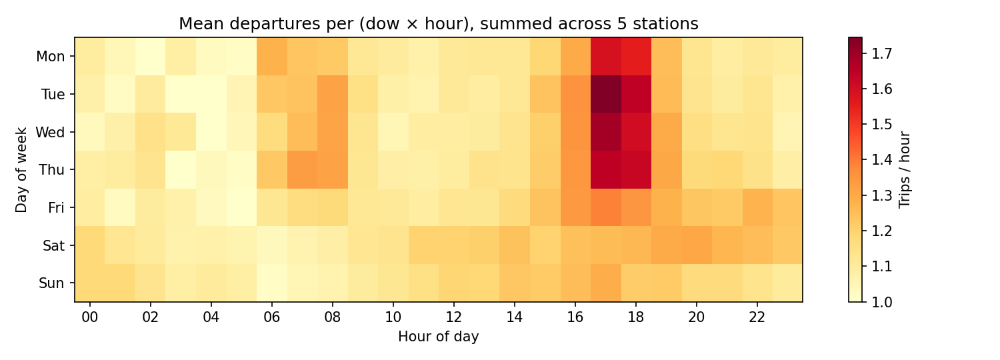

The demand profile is dominated by weekday rush hours: morning peak around 08:00 Mon–Fri and evening peak around 17:00–18:00 Mon–Fri, with weekend demand spread across midday. This `(dow, hour)` periodicity is precisely what the demand-profile heuristic exploits (§6.3); it is also why a learner that only adds calendar features beyond `dow` has limited room to add value.

### 3.4 Daily Calendar and Weather Context

For each episode day, `build_daily_context` (`src/citibikerl/rebalancing/context.py`) constructs a `DailyContext`:

| field | source |
|---|---|
| `day_of_week` | 0=Mon … 6=Sun |
| `is_weekend` | dow ≥ 5 |
| `month_of_year` | 1..12 |
| `is_holiday` | `pandas.tseries.holiday.USFederalHolidayCalendar` |
| `temperature_c` | NOAA TAVG |
| `precipitation_mm` | NOAA PRCP |
| `snowfall_mm` | NOAA SNOW |
| `wind_speed_m_s` | NOAA AWND |

NOAA daily summaries are downloaded by `scripts/get_weather_data.py` from the NCEI `daily-summaries` API for station `USW00014734` (Newark Liberty International Airport, used as the closest reliable Newark/JC daily station). The downloader emits both the CSV and a metadata JSON. Missing temperature / wind values are filled with the column median across the episode set; missing precipitation/snow are filled with 0.0.

Weather is **optional**. The full demand pipeline runs without `--weather-input`, in which case all weather fields are 0.0. Including weather changes the v4 state encoder (§5.3) but does not alter the environment dynamics or reward.

### 3.5 Train / Test Split

Two split strategies are supported:

1. **Fractional chronological** (`split_demand_dataset_temporal`): the earliest `train_fraction` of episodes train, the rest test.
2. **Explicit day boundary** (`split_demand_dataset_by_day`): all episodes before `test_start_day` train, the rest test.

The headline experiment uses the explicit-boundary form with `test_start_day = 2026-02-01`:

- **Train**: 2025-01-01 through 2026-01-31 → **396 episodes**
- **Test**: 2026-02-01 through 2026-02-28 → **27 episodes**

This is a strict future-month holdout: the test split's calendar features (month, holiday, weather distribution) are systematically distinct from the training split.

---

## 4. MDP Formulation

The environment is implemented in `src/citibikerl/rebalancing/env.py`.

### 4.0 One step in pictures

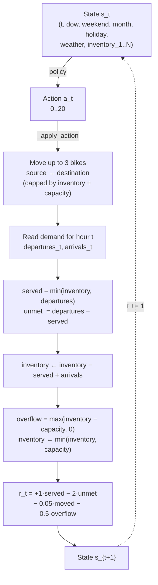

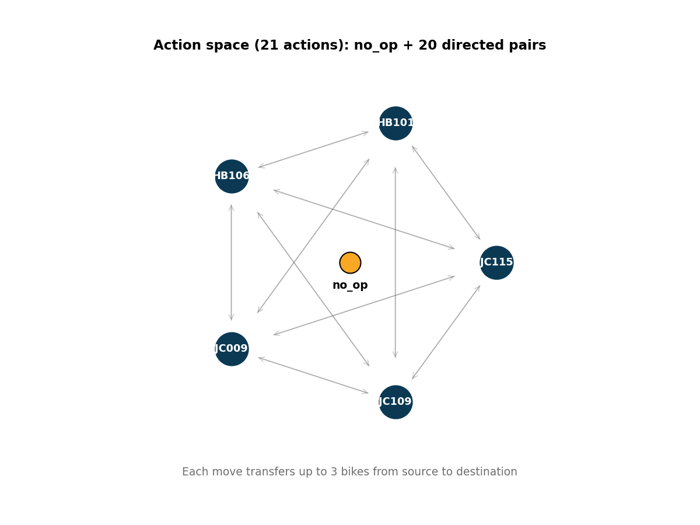

For 5 stations the action set has 21 elements: one `no_op` plus 20 directed source-destination pairs. Every move transfers up to 3 bikes from source to destination, subject to source availability and destination capacity. No action ever transfers bikes into or out of the 5-station subset — that flow happens only via observed demand (departures and arrivals to/from non-selected stations).

### 4.1 Episode and Time

- Each episode is one calendar day with horizon `H = 24`.
- Time index `t ∈ {0, 1, …, 23}` indexes the hour.
- The episode terminates after the 24th step.

### 4.2 State (full underlying)

The full underlying state at the start of step `t` is:

```
s_t = (t, day_of_week, is_weekend, month_of_year, is_holiday,
       temperature_c, precipitation_mm, snowfall_mm, wind_speed_m_s,
       inventory_1, …, inventory_N)
```

with `N = num_stations` (default 5). `inventory_i ∈ {0, 1, …, station_capacity}`.

`Observation` (`env.py:28`) is the dataclass that exposes this state to policies. The episode's calendar/weather fields are constant across `t` within a day; they vary across episodes.

### 4.3 Action Space

Discrete. Action 0 is `no_op` (do nothing). The remaining actions are ordered pairs `(source, destination)` with `source ≠ destination`:

```
A = {no_op} ∪ {(i, j) : i ≠ j, i, j ∈ {0, …, N-1}}
```

For N=5 this gives **|A| = 1 + 5·4 = 21** actions. A non-trivial action transfers up to `move_amount` (default 3) bikes from `source` to `destination`, subject to:

- `min(move_amount, source_inventory, station_capacity − destination_inventory)`

so an action is feasible to *some* extent whenever `source_inventory > 0` and `destination_inventory < station_capacity`. The number of bikes actually moved is reported as `info["moved_bikes"]`.

The action set is built in `RebalancingEnv.__init__` and is immutable for the lifetime of the env instance. Actions are encoded internally as integer indices; `env.action_label(idx)` renders the human-readable form (e.g., `"JC115->HB101"` or `"no_op"`).

### 4.4 Transition Dynamics

One step proceeds in this exact order, implemented in `RebalancingEnv.step` (`env.py:75`):

1. **Apply the action.** `_apply_action` computes feasible move size, debits source inventory, credits destination inventory. Returns `moved_bikes`.
2. **Read demand for the current hour.** `departures[t]` and `arrivals[t]` are vectors of length `N`.
3. **Compute served and unmet trips.** `served = min(inventory, departures)` element-wise; `unmet = departures − served`.
4. **Update inventory.** `inventory ← inventory − served + arrivals`. Subtract first, then add (so an arriving bike does not satisfy a same-hour departure — capacity is the binding constraint, not pickup-then-deposit ordering within the hour).
5. **Compute overflow and clip.** `overflow = max(inventory − station_capacity, 0)`; then `inventory ← min(inventory, station_capacity)`. Bikes in excess of capacity are *lost* from the system within this episode (modeling: no operator intervention beyond the chosen action).
6. **Return reward, done flag, info dict.**

Per-step `info` includes `served_trips`, `unmet_demand`, `moved_bikes`, `overflow_bikes`, `episode_index`, `day`, `time_index`. The environment is reset at the start of each episode to `initial_inventory` per station (default 10), which is well below capacity 20.

### 4.5 Reward Function

Implemented as a single linear combination at `env.py:93`:

```
r_t = served_reward · Σ served_i
    − unmet_penalty · Σ unmet_i
    − move_penalty_per_bike · moved_bikes
    − overflow_penalty · Σ overflow_i
```

Default coefficients (from `configs/environment.yaml`):

| coefficient | default | rationale |
|---|---:|---|
| `served_reward` | 1.0 | one unit per served trip — the operator's primary objective |
| `unmet_penalty` | 2.0 | unmet trips are *more* costly than uncaptured value (loss of customer goodwill) |
| `move_penalty_per_bike` | 0.05 | each transferred bike has small operating cost |
| `overflow_penalty` | 0.5 | overflowing bikes is wasteful but per-bike cost is below unmet |

Episode reward is `Σ_{t=0}^{23} r_t`, in the range roughly [80, 160] for the chosen station subset under any sensible policy. The relative weighting (unmet > overflow > moved) is what makes the policies non-trivial: more aggressive movement reduces unmet but adds movement and potentially overflow penalties.

### 4.6 Initial State

At `env.reset(episode_index)`:

- `time_index ← 0`
- `inventory ← initial_inventory · ones(N)` (default `10 · 1`, half of `station_capacity`)
- The episode's `DailyContext` is fixed for the day.

This initial inventory makes the first few hours feasible (no immediate stockouts) and gives both directions of action room to operate.

### 4.7 A Note on `station_capacity`

The simulator uses a uniform `station_capacity = 20` for every station. This value is **a modeling choice configured in `configs/environment.yaml`, not a measurement from the data.** The Citi Bike trip CSVs contain no dock-count column; real per-station capacity is published in the GBFS `station_information.json` feed, which this project does not ingest.

In reality, the five selected stations have heterogeneous capacities: JC115 (Grove Street PATH) and HB101 (Hoboken Terminal) are among the busiest stations in the system and carry ~40–60 docks; smaller stations carry ~15–25. The simulator's uniform 20 therefore *under-specifies* the high-activity stations the heuristic and learners actually select. Practical implications:

- The overflow constraint is tighter than reality at the busiest stations, so all policies hit overflow more often than they would in deployment.
- The heuristic's destination-overflow guard (`I[destination] >= capacity − 3`) fires earlier, sometimes blocking moves that would be feasible against a 50-dock station.
- Initial inventory of 10 corresponds to "half full" at capacity 20; under a real 50-dock station, the same starting count is "20% full," changing the early-hour stockout dynamics.

Conclusions on policy *ordering* are robust to this choice (relative comparisons hold under any uniform capacity), but absolute reward magnitudes and the precise overflow numbers in §11 reflect the 20-dock simulator, not deployment.

---

## 5. State Encoders

The full underlying state is high-dimensional. Different policies need different discretizations. The codebase defines five encoders living in `src/citibikerl/rebalancing/q_learning.py`.

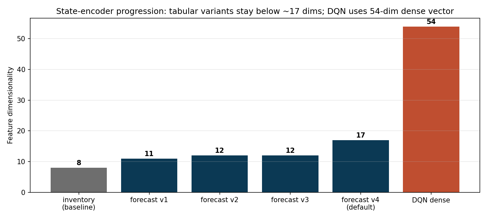

The tabular variants stay at ≤17 dimensions to keep the Q-table cardinality manageable; the DQN's dense encoder (54 dims) leverages function approximation and so does not pay the same cardinality cost. As §11.3 shows, this dimensionality progression is the central tension: more features improve in-distribution fit but reduce test-time coverage of the discrete tabular state.

### 5.1 Inventory Baseline (`INVENTORY_STATE_REPRESENTATION = "inventory_calendar_v1"`)

```
encode_state(t, dow, is_weekend, inventory; bucket_size, station_capacity)
  = (t, dow, is_weekend, *bucketed_inventory)
```

with `bucketed_inventory[i] = clip(inventory[i], 0, capacity) // bucket_size`. Default `bucket_size = 2` → 11 buckets per station for capacity 20. Tuple length: `3 + N`. Used by the demand-profile heuristic policy for state lookup, and by very early Q-learning experiments.

### 5.2 Forecast-Aware v1 (`FORECAST_STATE_REPRESENTATION_V1`, "forecast_profile_v1")

Length 11. Replaces the per-station inventory buckets with a *summary* of the predicted source/destination move:

```
(t, dow, is_weekend,
 heuristic_action_index,
 source, destination,
 source_inventory_bucket, destination_inventory_bucket,
 source_surplus_bucket, destination_shortage_bucket,
 route_pressure_bucket)
```

Where:

- `source` = `argmax(inventory + expected_arrivals − expected_departures)` (the station with the largest predicted surplus given the demand profile for that `(dow, t)`).
- `destination` = `argmin` of the same vector (largest predicted shortage).
- `*_bucket` values discretize surplus/shortage and inventory by `forecast_bucket_size` and `bucket_size` respectively, with separate clamps for inventory (capacity) and route pressure (`2 · capacity`).
- `heuristic_action_index` is the action index the demand-profile heuristic would take for this state, embedded so a fallback policy can read it without recomputing. This is the integer that `ForecastHeuristicPolicy` uses on the `min_visit_count` path.

### 5.3 Forecast-Aware v2 (`FORECAST_STATE_REPRESENTATION_V2`)

V1 + `month_of_year` appended, plus the heuristic action computed on raw (unbucketed) inventory rather than bucketed. Length 12.

### 5.4 Forecast-Aware v3 (`FORECAST_STATE_REPRESENTATION_V3`)

V2 except the heuristic action is computed on *bucketed* inventory (matching what a tabular learner sees), making the learner's view of "what the heuristic would do" consistent with its own state.

### 5.5 Forecast-Aware v4 (`FORECAST_STATE_REPRESENTATION = "forecast_profile_v4"`, current default)

V3 plus exogenous (calendar/weather) features:

```
(t, dow, is_weekend, heuristic_action,
 month_of_year, is_holiday,
 temp_bucket, precip_bucket, snow_bucket, wind_bucket,
 source, destination,
 source_inventory_bucket, destination_inventory_bucket,
 source_surplus_bucket, destination_shortage_bucket,
 route_pressure_bucket)
```

Length 17. Weather buckets:

| field | bucketing |
|---|---|
| `temp_bucket` | `clip(temperature_c, -15, 35); (temp + 15) // 5` → 0..10 |
| `precip_bucket` | piecewise: 0 = none, 1 = ≤2.5 mm, 2 = ≤10 mm, 3 = >10 mm |
| `snow_bucket` | piecewise: 0 / ≤5 / ≤25 / >25 mm |
| `wind_bucket` | `clip(wind_m_s, 0, 20) // 2` → 0..10 |

The state representation is selected by tag at training time (CLI `--state-representation`) and persisted in the saved model JSON. `build_q_state_encoder` (`q_learning.py:560`) reconstructs the right encoder from the tag for evaluation.

### 5.6 Dense DQN Encoder (`DQN_STATE_REPRESENTATION = "dense_forecast_exogenous_v1"`)

Implemented in `build_dense_state_encoder` (`dqn.py:297`). Concatenates several normalized feature blocks into a single `float64` vector:

| block | size | content |
|---|---:|---|
| Time-of-day | 2 | sin/cos of `2π · t/24` |
| Weekday one-hot | 7 | one-hot of `dow` |
| Month one-hot | 12 | one-hot of `month_of_year` |
| Calendar binaries | 2 | `is_weekend`, `is_holiday` |
| Weather scaled | 4 | `temp/20`, `log1p(precip)/log1p(50)`, `log1p(snow)/log1p(500)`, `wind/15`, all clipped |
| Inventory normalized | N | `inventory / capacity` |
| Expected departures | N | `demand_profile.departures[dow, t] / demand_scale` |
| Expected arrivals | N | similarly |
| Expected balance | N | `(inv + arr − dep) / demand_scale` |
| Source one-hot | N | one-hot of `argmax(expected_balance)` |
| Destination one-hot | N | one-hot of `argmin(expected_balance)` |
| Route pressure | 2 | clipped surplus & shortage at the chosen source/destination |

`demand_scale = max(1, capacity, max profile departures, max profile arrivals)`. For `N = 5` the resulting vector has length `2 + 7 + 12 + 2 + 4 + 5·5 + 2 = 54` features.

### 5.7 Demand Profile

Several encoders need a forecast of expected departures/arrivals. `build_demand_profile` (`profile.py`) averages observed `departures[d, t]` and `arrivals[d, t]` across training episodes grouped by `(dow, t)`. Returns a `DemandProfile` with shape `(7, 24, N)`. This is the *only* learned signal the heuristic uses, and it is computed exclusively from the training split.

---

## 6. Policies

All non-DQN policies implement `Policy.select_action(state, action_count) -> int`. DQN bypasses the discrete state and reads the `Observation` directly.

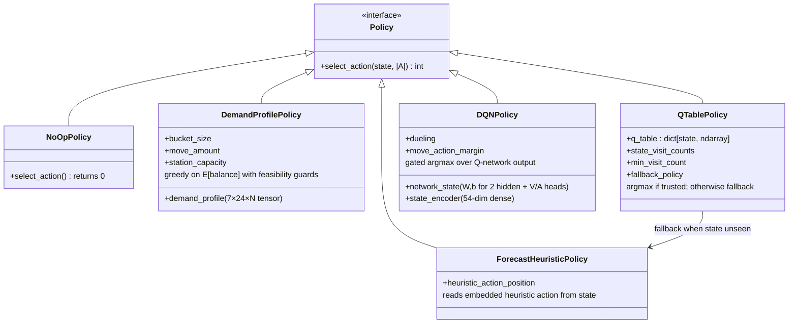

### 6.1 NoOpPolicy (`policies.py:14`)

Always returns 0. Used as the conservative baseline ("do nothing"). Calibrates how much value rebalancing can possibly add.

### 6.2 ForecastHeuristicPolicy (`policies.py:23`)

Reads the `heuristic_action` integer embedded at position 3 of any forecast-aware state and returns it (clamped to a valid index). Used as the **fallback policy** for `QTablePolicy` when the Q-table has not seen the current state, and as a no-op fallback when the state is too short.

### 6.3 DemandProfilePolicy (`policies.py:65`)

The strong heuristic. Decision flow:

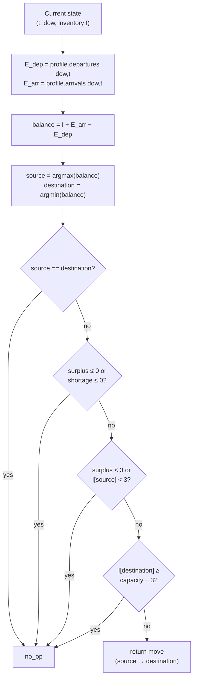

Algorithm (pseudocode):

```
At step t with inventory I and (dow, t):
  E_dep = demand_profile.departures[dow, t]
  E_arr = demand_profile.arrivals[dow, t]
  balance = I + E_arr − E_dep
  source = argmax(balance)
  destination = argmin(balance)
  surplus = max(balance[source], 0)
  shortage = max(−balance[destination], 0)
  if source == destination: return no_op
  if surplus <= 0 or shortage <= 0: return no_op
  if surplus < move_amount or I[source] < move_amount: return no_op
  if I[destination] >= capacity − move_amount: return no_op
  return (source → destination)
```

This is a one-step look-ahead policy: it picks the move that most reduces predicted next-hour imbalance, conditioned on the day-of-week and hour-of-day demand profile. It does **not** consider weather, holidays, or further-out hours. It is computed deterministically from training-split statistics.

This single policy is the project's de facto benchmark. Beating it consistently is the research bar.

### 6.4 QTablePolicy (`policies.py:38`)

Greedy policy over a learned Q-table:

```
At state s:
  if s in q_table and visit_count[s] >= min_visit_count:
    action = argmax(q_table[s])
    trusted_q_count += 1
  else:
    action = fallback_policy.select_action(s)
    fallback_count += 1
```

The two counters are read at evaluation time to compute per-episode `trusted_q_actions` and `fallback_actions`. This visibility is critical because, as we'll see in §11, on the strict holdout the Q-table is almost never trusted at the v4 representation.

`min_visit_count` is configurable. Default 1 (any visit during training counts), but `train_q_learning` can be configured to require more.

### 6.5 DQNPolicy (`dqn.py:82`)

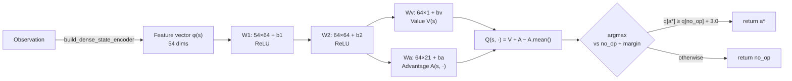


Greedy policy over the Q-network output, with an optional **move-action margin gate**:

```
q = network(encoder(observation))   # length |A|
action = argmax(q)
if action != 0 and q[action] < q[0] + move_action_margin:
  return 0    # demote to no_op
return action
```

The margin gate addresses the empirical failure mode that an unregularized DQN tended to take small-edge move actions on weak Q-value differences, causing over-movement. Setting `move_action_margin = 3.0` requires a move's Q-value to exceed `no_op` by 3 reward units before being selected.

---

## 7. Training

### 7.1 Tabular Q-learning (`q_learning.py:63`)

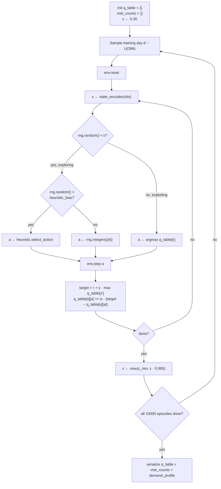

Standard ε-greedy Q-learning over discretized states. Pseudocode:

```
Initialize q_table : dict[state] -> zero vector of length |A|
Initialize state_visit_counts : dict[state] -> 0
ε ← initial_epsilon
heuristic = DemandProfilePolicy(...)

for training_episode in range(N_episodes):
  demand_episode ← rng.integers(num_episodes)        # uniform over training days
  obs ← env.reset(demand_episode)
  s   ← state_encoder(obs)
  while not done:
    state_visit_counts[s] += 1
    h   ← heuristic.select_action(inventory_state_encoder(obs))
    a, exploring, guided ← ε-greedy(q_table[s], ε,
                                     guided_action=h,
                                     guided_action_probability=heuristic_exploration_bias)
    obs', r, done, info ← env.step(a)
    s' ← state_encoder(obs')
    target ← r + γ · 0          if done
              r + γ · max q_table[s']  otherwise
    q_table[s][a] += α · (target − q_table[s][a])
    s ← s'; obs ← obs'
  ε ← max(ε_min, ε · ε_decay)
```

Key knobs (current `configs/training.yaml`):

| field | default |
|---|---:|
| `episodes` | 10000 |
| `alpha` | 0.2 |
| `gamma` | 0.95 |
| `epsilon` | 0.35 |
| `epsilon_decay` | 0.995 |
| `epsilon_min` | 0.05 |
| `bucket_size` | 2 |
| `forecast_bucket_size` | 2 |
| `heuristic_exploration_bias` | 0.0 |
| `min_state_visit_count` | 1 |
| `seed` | 7 |
| `state_representation` | `forecast_profile_v4` |

`heuristic_exploration_bias > 0` partly replaces purely uniform exploration with the heuristic action — i.e., when ε fires, with this probability the agent takes the heuristic action instead of a uniformly random one. This was added as an exploration-shaping mechanism for sparse forecast-aware states.

Per training episode, the metrics CSV records `total_reward`, `served_trips`, `unmet_demand`, `moved_bikes`, `overflow_bikes`, `epsilon`, and three exploration counters: `exploratory_actions`, `guided_exploration_actions`, `heuristic_match_actions` (how often the chosen action matched the heuristic).

### 7.2 NumPy DQN (`dqn.py:98`)

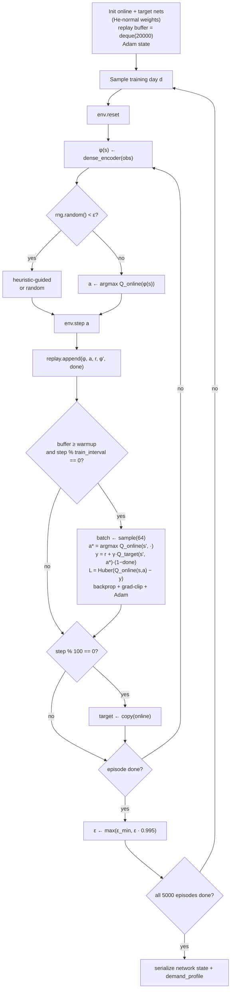

The DQN is implemented from scratch in NumPy. No PyTorch or Jax dependency. The repo's `pyproject.toml` lists only `numpy, pandas, matplotlib, pyyaml`.

#### 7.2.1 Network Architecture

Two hidden ReLU layers with width `hidden_dim = 64`. By default, **dueling** value/advantage heads sit on top:

```
z1 = inputs @ W1 + b1     ; a1 = relu(z1)
z2 = a1 @ W2 + b2         ; a2 = relu(z2)
if dueling:
  V = a2 @ Wv + bv         # shape (B, 1)
  A = a2 @ Wa + ba         # shape (B, |A|)
  Q = V + A − A.mean(axis=1, keepdims=True)
else:
  Q = a2 @ W3 + b3
```

For a 54-dim input and 21 actions: parameters are `54·64 + 64 + 64·64 + 64 + 64·1 + 1 + 64·21 + 21 ≈ 5,950`. Initialization is He-normal scaled by `√(2/fan_in)` for each weight matrix, biases zero.

#### 7.2.2 Loss and Optimization

Loss is **Huber** (smooth L1) on the TD error of the chosen action's Q-value. With **Double DQN** target selection enabled by default:

```
a*  = argmax_{a'} Q_online(s', a')
y   = r + γ · (1 − done) · Q_target(s', a*)
δ   = Q_online(s, a) − y
L   = mean(huber(δ))
```

If `double_dqn=False`, the target uses `max_{a'} Q_target(s', a')`. The target network is hard-copied from the online network every `target_update_interval` env steps (default 100).

Backprop is hand-coded for both the dueling and non-dueling heads, then the two-layer ReLU stack. Adam with `β1=0.9, β2=0.999, ε=1e-8` updates weights (`_apply_gradients_adam`, `dqn.py:615`). Global gradient norm clipping at `gradient_clip` (default 5.0) is applied before the Adam step.

#### 7.2.3 Replay Buffer

A `collections.deque` of fixed `replay_capacity` holding `(state_vector, action, reward, next_state_vector, done)`. Sampling is uniform without replacement at batch size `batch_size`. Training begins only after the buffer accumulates `replay_warmup` transitions and on every `train_interval`-th env step thereafter.

#### 7.2.4 ε-greedy with Heuristic Guidance

Same shaping as tabular Q: a fraction `heuristic_exploration_bias` of exploratory actions are replaced by the heuristic action. The intent is to give the replay buffer transitions that are *structurally meaningful* (move bikes when the heuristic says so), not just random.

#### 7.2.5 Hyperparameters (current `configs/dqn_training.yaml`)

| field | default | note |
|---|---:|---|
| `episodes` | 5000 | matches the report's headline run |
| `gamma` | 0.99 | |
| `epsilon` | 0.35 → `epsilon_min` 0.05 with decay 0.995 | |
| `learning_rate` | 0.0005 | |
| `batch_size` | 64 | |
| `replay_capacity` | 20000 | |
| `replay_warmup` | 256 | |
| `hidden_dim` | 64 | |
| `target_update_interval` | 100 | |
| `train_interval` | 1 | gradient update every env step (after warmup) |
| `gradient_clip` | 5.0 | global norm |
| `heuristic_exploration_bias` | 0.5 | |
| `move_action_margin` | 3.0 | gate at evaluation time |
| `double_dqn` | true | |
| `dueling` | true | |
| `seed` | 7 | |

These were not always the YAML defaults. An audit of the saved seed-7 model (`outputs/models/jc_2025_full_year_to_202602_holdout_dqn_margin_v1_model.json`) revealed the report's headline was actually trained with these values, while `configs/dqn_training.yaml` previously shipped weaker defaults (600 episodes, lr=1e-3, replay=10000, bias=0.25). The YAML has since been bumped to match the report; this was confirmed empirically: an 8-seed sweep at the YAML defaults gave mean reward 113.4 (none beat heuristic), versus 117.3 at the report config (1 of 8 beat heuristic). See §11.4.

### 7.3 Run Orchestration (`scripts/run_experiment.py`)

The single-command experiment entry point. For a given input flow file (or comma-separated list), it:

1. Loads dataset + station summary + (optional) weather context.
2. Builds `RebalancingEnvConfig` and `TrainingConfig` with CLI/YAML/default precedence (CLI > YAML > hardcoded default).
3. Splits chronologically (fractional or by `--test-start-day`).
4. Trains tabular Q-learning on the train split.
5. Saves the Q-table JSON.
6. Evaluates `NoOpPolicy`, `DemandProfilePolicy`, and `QTablePolicy` (with `ForecastHeuristicPolicy` fallback) on each named split and writes per-episode CSV metrics.
7. Reloads the saved Q-table and re-evaluates (round-trip sanity).
8. Generates the training-reward and policy-comparison PNG figures.
9. Writes a single `_experiment_summary.json` with all hyperparameters, station IDs, episode counts, the git HEAD, and per-policy mean metrics.

`scripts/train_dqn.py` is the analogous DQN entry point but evaluates `evaluate_dqn_policy` for the trained network, and uses `DQNTrainingConfig`.

`scripts/evaluate_saved_policy.py` and `scripts/evaluate_saved_dqn.py` re-load a serialized model and re-run only the evaluation pass — useful when the same trained policy needs evaluating against a new dataset slice.

---

## 8. Serialization

### 8.1 Tabular Q (`io.py`)

`SavedModel` JSON layout:

```json
{
  "station_ids": ["JC115", ...],
  "actions":     [null, [0,1], [0,2], ...],
  "q_table":     {"5|1|0|7|2|...": [0.0, 1.5, ...], ...},
  "state_visit_counts": {"5|1|0|7|...": 12, ...},
  "environment": {... env_config dict ...},
  "training":    {... training_config dict ...},
  "state_representation": "forecast_profile_v4",
  "demand_profile": {
    "departures": [[[...]]],
    "arrivals":   [[[...]]]
  }
}
```

State tuples are encoded as `|`-joined integers because JSON keys must be strings. The demand profile is included so an evaluator can recompute the heuristic action for fallback without needing the original training data.

### 8.2 DQN (`dqn.py:373`)

`SavedDQNModel` stores the entire network state dict (`W1, b1, W2, b2`, plus either `Wv/bv/Wa/ba` for dueling or `W3/b3` for vanilla), env config, training config, demand profile, state representation tag, and feature dimension. Loading materializes a `DQNPolicy` whose state encoder reuses the saved demand profile to make decisions identically to training.

---

## 9. Engineering Infrastructure

### 9.1 Build / Quality Gates

| target | what it does |
|---|---|
| `make build-check` | `python -m compileall src scripts`; runs `citibikerl.cli` to confirm required paths exist |
| `make check-structure` | Bash script verifying all expected files/dirs exist |
| `make check-conflicts` | `git grep` for git conflict markers |
| `pytest` | 41 tests covering data, env, policies, Q-learning, DQN, IO, scripts, plots |
| `ruff check .` | linting |

### 9.2 Test Coverage Summary

| file | what it covers |
|---|---|
| `test_imports.py` | package importability; matplotlib not pulled in by `import citibikerl.rebalancing` |
| `test_data_validation.py` | required-column check; YAML section loading edge cases |
| `test_dataset_scripts.py` | CLI scripts for validate/preprocess/get_dataset including ZIP inputs and metadata aggregation |
| `test_rebalancing_data.py` | episode/day tensor construction, top-N selection, multi-month merging, weather merge |
| `test_rebalancing_env.py` | step semantics: action then demand, served/unmet/inventory, calendar fields |
| `test_q_learning.py` | tabular Q beats no-op on a synthetic problem; demand-profile policy beats no-op; encoder shapes; fallback semantics; visit-count gating |
| `test_dqn.py` | DQN beats no-op on a synthetic problem; save/load round-trip; move_action_margin gate flips marginal moves to no_op |
| `test_model_io.py` | Q-table serialization round-trip |
| `test_experiment.py` | end-to-end experiment writes all artifacts and the summary JSON for both fractional and explicit-boundary splits |
| `test_reporting.py` | training and comparison plots are generated and non-empty |

All 41 tests run in under 3 seconds.

### 9.3 Reproducibility

Every experiment script writes an `_experiment_summary.json` containing:

- `generated_at_utc` timestamp
- `input_path`, `weather_input`
- `selected_station_ids`, `station_count`, `demand_episode_count`
- `train_episode_count`, `test_episode_count`, `primary_eval_split`, `split_strategy`
- `git_head` (current commit hash)
- Full `environment` and `training` dicts
- Per-split summaries: `baseline_summary`, `heuristic_summary`, `trained_summary`, plus the saved-model round-trip equivalents.

Combined with the per-seed CSV metrics, this makes every published number traceable back to a specific code revision and configuration.

### 9.4 Determinism

Random number generation uses `numpy.random.default_rng(seed)`. With identical seed, identical hyperparameters, identical input data, and identical NumPy version, training is deterministic. This was empirically verified by reloading the report's saved seed-7 DQN model and reproducing its 123.63 average reward exactly.

---

## 10. Evaluation Protocol

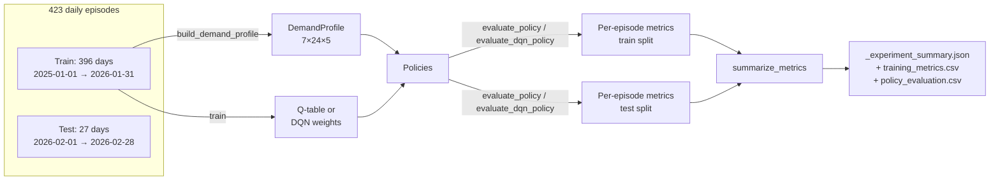

### 10.1 Standard Run

For each evaluation split (train and test):

1. For each episode `i` and each policy `π`:
   - `env.reset(i)`; loop 24 steps with `π.select_action(state, |A|)`.
   - Accumulate `total_reward`, `served_trips`, `unmet_demand`, `moved_bikes`, `overflow_bikes`.
   - For `QTablePolicy`: also `fallback_actions`, `trusted_q_actions`.
2. Return a list of dicts; `summarize_metrics` averages each numeric column across episodes.

The standard reported aggregates per policy:

| metric | meaning |
|---|---|
| `avg_reward` | mean episode reward |
| `avg_served_trips` | mean trips served per episode |
| `avg_unmet_demand` | mean unmet trips per episode |
| `avg_moved_bikes` | mean bikes moved per episode |
| `avg_overflow_bikes` | mean overflow per episode |
| `avg_fallback_actions` | only for tabular Q+fallback: mean episodes-worth of heuristic-fallback hits |
| `avg_trusted_q_actions` | only for tabular Q+fallback: mean episodes-worth of trusted Q decisions |

Each rollout step contributes exactly one decision, so `fallback + trusted = 24` per episode.

### 10.2 Holdout Choice

The headline experiment uses an explicit February-2026 holdout. The 27 test episodes are unseen by training. Calendar features (month=2, holiday set, weather distribution) are not present in the training distribution by construction. This is the strongest realistic holdout the data permits.

A weaker development split — within-February train/test — was used during early iteration (`outputs/tables/jc_202602_top5_*`).

---

## 11. Results

All numbers in this section come directly from `outputs/` artifacts in the repository.

### 11.1 Headline (Feb-2026 Holdout)

Source: `outputs/logs/jc_2025_full_year_to_202602_holdout_weather_v1_experiment_summary.json`.

Test split (27 episodes, 5 stations, 24 hours/day):

| Policy | Avg Reward | Avg Unmet | Avg Moved | Avg Overflow | Trust-Q | Fallback |
|---|---:|---:|---:|---:|---:|---:|
| `baseline_no_op` | 109.33 | 12.48 | 0.00 | 28.81 | 0.00 | 0.00 |
| `heuristic_demand_profile` | **122.45** | 8.07 | 9.11 | 28.11 | — | — |
| `q_policy_with_heuristic_fallback` (v4) | 122.21 | 8.15 | 9.22 | 28.15 | 0.04 | 23.96 |

The Q-policy with heuristic fallback effectively *is* the heuristic on this holdout: out of 24 hourly decisions per episode, the Q-table is consulted on average only 0.04 of them — i.e., **0.17% of decisions** use a learned value. The other 99.83% come from the embedded heuristic action.

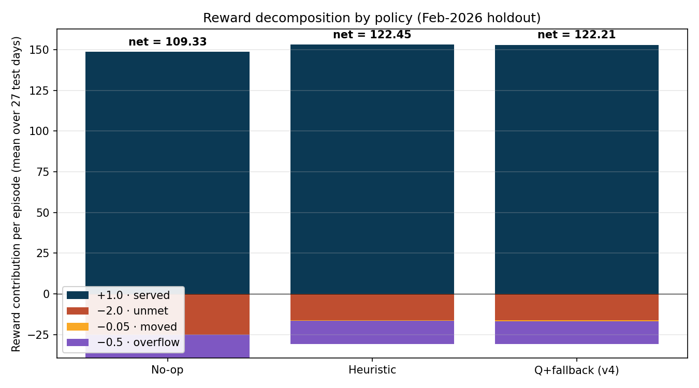

The reward decomposition makes the structural difference visible. Both no-op and the heuristic earn the bulk of their reward from served trips, then pay for unmet and overflow. The no-op baseline pays a much larger unmet-demand penalty (12.48 unmet × 2.0 = −24.96) and gets correspondingly fewer served trips. The heuristic and Q+fallback look nearly identical because the latter *is* the heuristic on 99.83% of decisions; the small difference comes from the 0.04 trusted-Q decisions per episode disagreeing with the heuristic and slightly reducing reward.

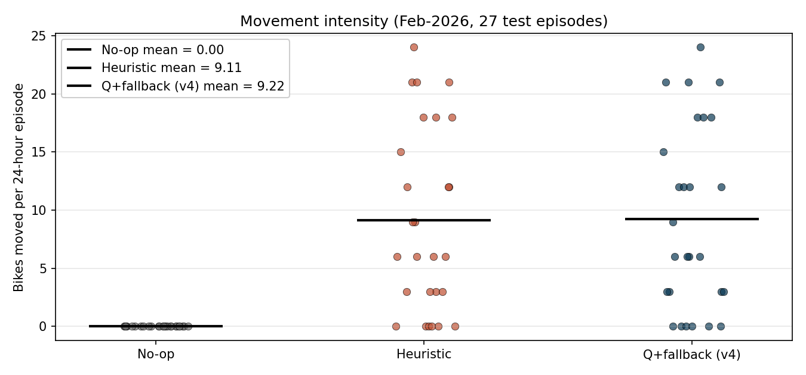

Per-episode move counts: no-op = 0 by definition, heuristic averages 9.11 (i.e., the four-guard policy chooses to move on roughly 3 of the 24 hours per day, transferring 3 bikes each time), and Q+fallback nearly matches at 9.22 — again because it is mostly executing the heuristic action.

### 11.2 Tabular Q Development Progression

Within-February split, 21-train / 7-test mini-holdout (small-N, but useful for relative ordering):

| Policy | Avg Reward |
|---|---:|
| `baseline_no_op` | 122.50 |
| Q with inventory-only state | 121.12 |
| Q with calendar features added | 122.48 |
| Q with calendar + heuristic features | 127.47 |

Files:

- `outputs/tables/jc_202602_top5_split_v1_policy_evaluation.csv`
- `outputs/tables/jc_202602_top5_calendar_v1_policy_evaluation.csv`
- `outputs/tables/jc_202602_top5_calendar_heuristic_v1_policy_evaluation.csv`

This sequence motivates the v1→v4 progression: each added feature is a step up *within* the same month, but as §11.1 shows, those gains do not transfer cleanly to a strict future-month holdout because they encourage memorizing fine-grained training-only states.

### 11.3 Coarse vs. Fine Tabular State (Coverage Experiment)

To test the hypothesis that the v4 result was coverage-limited rather than value-limited, the same Feb-2026 holdout was rerun with the coarser 11-tuple v1 encoder (no month, no holiday, no weather):

| Policy | Avg Reward | Avg Unmet | Avg Moved | Trust-Q | Fallback |
|---|---:|---:|---:|---:|---:|
| `baseline_no_op` | 109.33 | 12.48 | 0.00 | — | — |
| `heuristic_demand_profile` | 122.45 | 8.07 | 9.11 | — | — |
| Q v4 (17-tuple, weather + holiday) | 122.21 | 8.15 | 9.22 | 0.04 | 23.96 |
| Q v1 (11-tuple, no exogenous) | 115.78 | 10.19 | 14.33 | **14.48** | 9.52 |

Source: `outputs/logs/jc_2025_full_year_to_202602_holdout_coarse_v1_experiment_summary.json`.

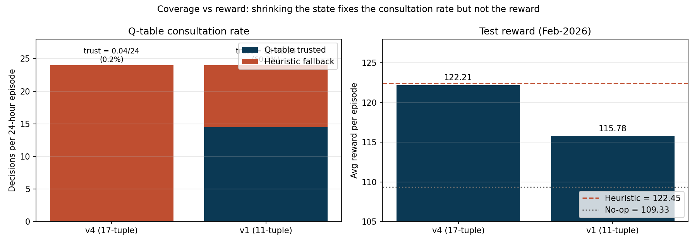

Coverage rose **from 0.17% to 60.3%** as predicted — the Q-table is actually consulted now. But the Q-policy *underperforms* the heuristic by 6.7 reward points and the v4 Q+fallback by 6.4 points. Interpretation: the v4 Q+fallback's 122.21 was the heuristic in disguise; once coverage is real, the learned values themselves are no better than the heuristic. The bottleneck for tabular Q is therefore **value quality** at this episode budget, not coverage.

### 11.4 DQN Seed Sweep (Stability Study)

The headline DQN result in `report_draft_v1.md` is seed-7 = 123.63 reward, the only number that beat the heuristic. To assess whether that is a stable property or a lucky basin, two 8-seed sweeps were run over the same Feb-2026 holdout.

#### Sweep A: weak (former YAML defaults)

Hyperparameters: 600 episodes, lr=1e-3, replay=10000, heuristic_bias=0.25.

| seed | avg_reward |
|---:|---:|
| 7 | 111.63 |
| 11 | 110.81 |
| 19 | 119.29 |
| 23 | 108.27 |
| 31 | 116.22 |
| 37 | 117.71 |
| 41 | 109.28 |
| 43 | 114.18 |
| **mean ± std** | **113.42 ± 4.05** |

0/8 beat heuristic 122.45. 6/8 beat baseline 109.33.

#### Sweep B: report config (now also YAML default)

Hyperparameters: 5000 episodes, lr=5e-4, replay=20000, heuristic_bias=0.5.

| seed | avg_reward | avg_unmet | avg_moved |
|---:|---:|---:|---:|
| 7 | **123.63** | 8.30 | 20.07 |
| 11 | 113.61 | 10.59 | 25.26 |
| 19 | 116.95 | 9.93 | 26.63 |
| 23 | 110.52 | 12.07 | 34.48 |
| 31 | 119.58 | 9.07 | 30.70 |
| 37 | 119.19 | 9.37 | 30.26 |
| 41 | 119.86 | 9.22 | 28.63 |
| 43 | 114.64 | 10.59 | 30.26 |
| **mean ± std** | **117.25 ± 4.18** | 9.89 | 28.29 |

The 95% CI on the mean is **[114.35, 120.14]** — entirely below the heuristic's 122.45. Seed 7 reproduces the report exactly. **1/8 seeds beats the heuristic; 7/8 do not. All 8 beat the baseline.**

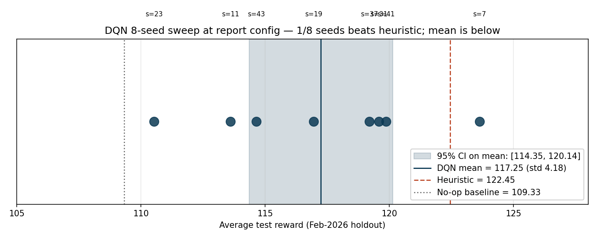

The 8 seeds are visualized above as a strip plot. The 95% CI on the mean (shaded band) does not reach the heuristic line; only seed 7 lies above it. This is the strongest available evidence that the report's headline 123.63 is a lucky-seed effect rather than a stable property of the algorithm.

The conclusion: the report's headline 123.63 is not a stable property of the method. It is the maximum over 8 seeds of a distribution whose mean lies below the heuristic. RL adds value over no-op, but not robustly over a one-step look-ahead heuristic at this problem size.

Sources: `outputs/tables/dqn_seed_sweep/dqn_margin_8seed_sweep_summary.csv` (Sweep A) and `outputs/tables/dqn_seed_sweep/dqn_repcfg_8seed_summary.csv` (Sweep B).

### 11.5 Move-Margin Gate Effect

From the original v1 (unregularized) vs. v2 (margin = 3.0) DQN comparison in `report_draft_v1.md`:

| Policy | Avg Reward | Avg Unmet | Avg Moved |
|---|---:|---:|---:|
| `heuristic` | 122.45 | 8.07 | 9.11 |
| DQN no margin | 122.12 | 8.19 | 44.63 |
| DQN with margin (seed 7) | 123.63 | 8.30 | 20.07 |

The margin gate cuts gratuitous moves (44.63 → 20.07) while leaving served trips ≈ unchanged, raising reward by reducing `move_penalty_per_bike · moved_bikes` and the resulting overflow. It does *not* improve served trips.

### 11.6 Why the heuristic is so strong

The empirical fact that the demand-profile heuristic (122.45) ties or beats every learner on the strict holdout is not an accident of small-N evaluation. It reflects six structural properties of this MDP, each of which independently shrinks the headroom available to a learner.

**1. Bike-share demand is dominated by `(day_of_week, hour_of_day)`.** The dataset's strongest signal is commuter periodicity: weekday mornings around 08:00 and weekday evenings around 17:00–18:00 are the dominant hours, with weekend demand spread across midday. The demand heatmap in §3.3 shows this directly. Group-by-(dow, hour) means are the most natural non-parametric estimator of that signal, and the heuristic's `DemandProfile` is exactly that estimator. Anything more sophisticated competes with a forecaster that already captures the bulk of the explainable variance.

**2. The reward is myopic.** The reward function pays `+1` per served trip *this hour* and `−2` per unmet trip *this hour*, with a small per-bike movement cost. There is no large multi-step term. With γ=0.95 over a 24-step episode, hour 24 is worth ≈0.30× hour 1, but more importantly, the per-hour optimum aligns with the per-day optimum because the demand profile is itself stable across hours. A one-step look-ahead policy that maximizes next-hour expected balance is therefore close to per-step optimal, and per-step optimal is close to per-episode optimal.

**3. The action space is tiny and well-structured.** 21 discrete actions per hour. The heuristic's rule — "move from highest predicted surplus to highest predicted deficit, gated on feasibility" — is almost certainly the best single action available at most states. Of the 20 non-trivial moves, most are strictly worse (smaller predicted improvement) or infeasible. There is no clever combinatorial action a learner can discover that the heuristic missed: the search space is too small to hide one.

**4. The four feasibility guards are precisely right.** A naive "always move bikes from high-inventory to low-inventory stations" policy would over-move and incur both the per-bike penalty and overflow at the destination. The heuristic's guards eliminate exactly the move types that the reward function punishes:

- Guard 3 prevents a `0.05 × moved` penalty on moves that won't actually displace 3 bikes.
- Guard 4 prevents `0.5 × overflow` at the destination.
- Guard 2 prevents speculative moves at structurally balanced stations.

The result is `avg_moved_bikes = 9.11` per episode for the heuristic versus `28.29` for the unregularized DQN seed-mean. The heuristic achieves the same served-trip count with one third the movement, which is exactly what the reward function rewards.

**5. The training data is rich enough for stable forecasts.** With 396 training days, each `(dow, hour)` cell has roughly 57 samples (sometimes more, sometimes fewer due to seasonal effects). That is enough for the per-cell mean to be a low-variance estimator. Test-time `(dow, hour)` cells are not novel — Wednesdays at 08:00 occur in February too — so the forecast generalizes essentially perfectly across the holdout.

**6. The censored-demand approximation actually helps the heuristic.** The simulator's "demand" comes from completed trips, not attempted-but-unfulfilled rentals (Citi Bike does not publish the latter). Historical departures are therefore bounded above by historical bike supply — they reflect the demand pattern that the real system *was able to serve*. The heuristic, also trained on this same distribution, matches the simulator's demand patterns by construction. A learner would need to discover structure beyond this matched distribution to outperform, but no such structure is available in the data.

These six points combine into a single structural claim: **the heuristic is a near-optimal myopic policy on an MDP whose dominant structure is myopic.** RL's traditional advantages (multi-step credit assignment, learning hidden state, adapting online) are precisely the advantages this MDP does not reward strongly. The natural escape route is therefore not "more RL" but a different problem framing — a residual learner that takes the heuristic as prior and adds a learned correction (§14, item 1), or a richer environment (more stations, route-level travel costs, terminal-state reward) where multi-step structure starts to matter.

---

## 12. Diagnosis

The repository contains three distinct learners (tabular Q v4, tabular Q v1, DQN). Each fails to robustly beat the heuristic for a different reason:

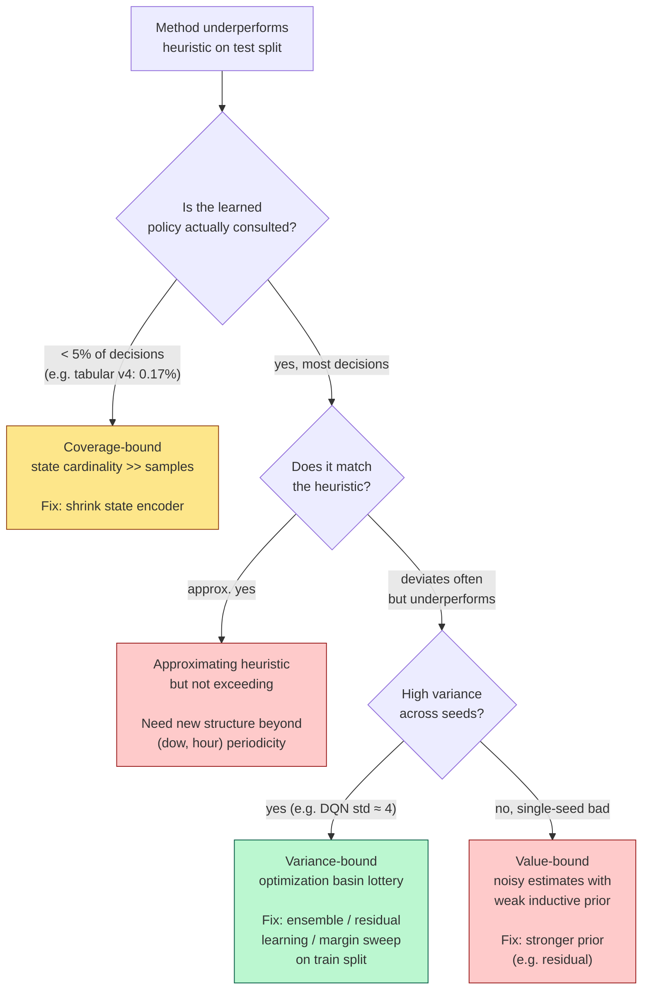

Mapping to the three concrete failure modes observed in this repo:

- **Tabular Q v4** → **coverage-bound** (path B → C). 17-tuple state, 0.04 trusted-Q decisions per 24-hour episode. Fixed by shrinking to v1.
- **Tabular Q v1** → **value-bound** (path B → D → F → H). 60.3% coverage but learned values worse than the one-step heuristic.
- **DQN** → **variance-bound** (path B → D → F → G). Function approximation removes the coverage problem; bottleneck is seed-to-seed optimization variance.

### 12.1 Tabular Q v4 — Coverage-bound

- 17-tuple state with weather/holiday buckets explodes the cardinality.
- Training visits 9,504 distinct state hashes maximum (396 episodes × 24 steps), most of which are unique.
- Test states are almost all novel — `min_visit_count >= 1` filter passes for only 0.04 of 24 hourly decisions per episode.
- Net effect: the policy is the heuristic with a near-zero learned correction. Improving training cannot help because the Q-table simply isn't consulted at test time.

### 12.2 Tabular Q v1 — Value-bound

- 11-tuple state has manageable cardinality. Coverage rises to 60.3%.
- Now the Q-table actually drives most decisions — and underperforms the heuristic by 6.7 reward points.
- The reason: with 10,000 episodes and many states still seeing only a handful of visits, value estimates are noisier than the deterministic, well-specified one-step heuristic prediction. Tabular Q has no inductive prior; the heuristic does (the demand-profile structure).

### 12.3 DQN — Variance-bound

- Function approximation handles unseen states; the network produces a real prediction for every test feature vector. Coverage is not the problem.
- Across 8 seeds at the report's strong configuration (5000 episodes, 5e-4 lr, 20k replay), reward is 117.25 ± 4.18, well below the heuristic.
- Variance comes from the optimization basin (init + replay-sample order). More episodes per seed do not shrink the variance — the network has plausibly converged within each run.
- The 1/8 winning seed is statistically expected if the underlying distribution mean is around 117 and std is around 4: the heuristic at 122.45 is roughly 1.25 standard deviations above the mean, giving a per-seed P(beat heuristic) ≈ 11%, which over 8 seeds yields a ≈ 60% chance of *at least one* exceedance — close to what we observed.

In all three cases, **adding more training cannot fix the bottleneck**. The diagnosis suggests three different remediation paths:

1. **For tabular Q**: shrink the state to maximize coverage, but accept this caps the achievable reward at the heuristic's level.
2. **For DQN**: reduce variance via seed ensembling, residual learning, or hyperparameter tuning on the train split rather than post-hoc seed selection.
3. **For the system as a whole**: change what is being learned. Train a policy that learns *deviations from the heuristic* rather than replacing it. The heuristic captures the dominant structural signal; the learner only needs to add a small correction conditioned on context the heuristic ignores (holidays, weather, multi-step look-ahead).

---

## 13. Limitations

### 13.1 Modeling

- **Five stations.** The MDP intentionally limits scope. Real Citi Bike systems have hundreds of stations and route-level travel costs that are absent here.
- **Pairwise fixed-size transfers.** Real operators use trucks with capacity > 1 and serial routes; the action set here is independent single-edge moves of 3 bikes.
- **Uniform `station_capacity = 20` is a modeling assumption, not a measurement.** The Citi Bike trip data does not include dock counts. Real Jersey City stations are heterogeneous — JC115 and HB101 carry roughly 40–60 docks each, smaller ones ~15–25. The simulator's uniform 20 is tighter than the deployment reality at the busiest stations and changes the overflow / move trade-off. Conclusions on policy ordering are robust to this choice; absolute reward magnitudes and per-station overflow numbers are simulator-specific. Ingesting the GBFS `station_information.json` feed would correct this. See §4.7 for the operational consequences.
- **Initial inventory is fixed at 10 per station.** Real operations begin each day at a state determined by the prior day's terminal state; this episode model resets daily.
- **Within-hour dynamics are sequential, not interleaved.** The model applies the action, then the entire hour's demand. Reality is interleaved arrivals and departures; for hourly aggregation this is a reasonable approximation but it does throw away within-hour pickup/dropoff orderings.
- **Overflow lost.** Bikes in excess of capacity vanish from the system within an episode. A real operator's truck might pick them up.

### 13.2 Data

- **One weather station.** USW00014734 (Newark Liberty) is the closest reliable NOAA station to Jersey City but is not a literal Jersey City reading; precipitation and snow can differ at the city scale.
- **No event-level demand features.** Concerts, holidays, weather warnings, and PATH/subway service incidents all shift demand and are not represented beyond the federal-holiday flag and daily weather averages.
- **Demand profile from training only.** The `DemandProfile` is computed once on the training split; real operations would update it online.

### 13.3 RL

- **Tabular state.** Even v4 quantizes weather and inventory aggressively; finer bins worsen coverage.
- **Single-objective scalar reward.** A multi-objective (served vs. moves vs. overflow) Pareto framing might reveal trade-offs the scalar reward hides.
- **No PER, no n-step returns, no Rainbow extensions.** The DQN uses Double + dueling but stops there. Modest add-ons (prioritized replay, n-step bootstrapping, NoisyNet exploration) could plausibly tighten the seed variance.
- **Seed sweep is 8.** A 30-seed run with proper bootstrap CIs would be more defensible. 8 was chosen to keep total runtime under an hour at the report config.

---

## 14. Future Work

In rough order of expected payoff for the central research question (beat the heuristic robustly):

1. **Residual learner around the heuristic.** Output the heuristic action by default; the network learns when and how to deviate. Preserves the heuristic's strong inductive prior.
2. **Seed-ensemble DQN.** Average per-action Q across N trained networks at decision time. Variance reduction targets the actual failure mode.
3. **Margin sweep on the train split.** Pick `move_action_margin` by train-split reward, then evaluate once on the test split. Cuts post-hoc selection bias.
4. **Lower learning rate + more replay warmup + LayerNorm.** Standard prescriptions for DQN stability that have not been tried here.
5. **Expand to more stations.** Increases the per-step decision space and may give RL room to find structure the heuristic misses (e.g., multi-step routing).
6. **Multi-step value targets.** n-step returns or λ-returns could improve credit assignment over the 24-step episode.
7. **More seasonally complete data.** Spring/summer demand patterns differ qualitatively from winter; a 2-year holdout would test cross-seasonal generalization.

---

## 15. Reproducibility Recipe

To reproduce the headline numbers from a clean checkout:

```bash
# 1. Install (editable + dev tools)
pip install -e '.[dev]'

# 2. Fetch raw data (one month example)
python scripts/get_dataset.py \
  --url https://tripdata.s3.amazonaws.com/JC-202602-citibike-tripdata.csv.zip \
  --output data/raw/JC-202602-citibike-tripdata.csv

# 3. Fetch weather (NOAA Newark, full study window)
python scripts/get_weather_data.py \
  --station USW00014734 \
  --start-date 2025-01-01 --end-date 2026-02-28 \
  --output data/external/noaa_daily_usw00014734_20250101_20260228.csv

# 4. Validate + preprocess each month
make dataset-validate INPUT=data/raw/JC-202602-citibike-tripdata.csv
make preprocess-data \
  INPUT=data/raw/JC-202602-citibike-tripdata.csv \
  OUTPUT=data/processed/jc_202602_hourly_flows.csv

# 5. End-to-end experiment (Feb-2026 holdout, all 14 months, weather)
PYTHONPATH=src python scripts/run_experiment.py \
  --input "data/processed/jc_202501_hourly_flows.csv,…,data/processed/jc_202602_hourly_flows.csv" \
  --weather-input data/external/noaa_daily_usw00014734_20250101_20260228.csv \
  --test-start-day 2026-02-01 \
  --episodes 10000 \
  --output-prefix jc_2025_full_year_to_202602_holdout_weather_v1

# 6. DQN with margin gate, report config (now also YAML default)
PYTHONPATH=src python scripts/train_dqn.py \
  --input "<same comma-separated list>" \
  --weather-input data/external/noaa_daily_usw00014734_20250101_20260228.csv \
  --test-start-day 2026-02-01 \
  --output-model outputs/models/dqn_margin_v1.json \
  --output-training-metrics outputs/tables/dqn_margin_v1_training.csv \
  --output-evaluation-metrics outputs/tables/dqn_margin_v1_eval.csv

# 7. Tests + lint
PYTHONPATH=src pytest -x
ruff check .
```

Every script writes its own `_metadata.json` or `_experiment_summary.json` so artifacts can be cross-referenced back to the exact configuration that produced them.

---

## 16. Summary for the Reader

This repository implements a complete, reproducible reinforcement-learning study of a small bike-rebalancing MDP grounded in real Citi Bike trip data, real NOAA weather, and U.S. federal holidays. It includes:

- An end-to-end data pipeline (download → validate → preprocess → demand tensors).
- A discrete-action MDP with explicit transition dynamics, a four-term reward, and a 24-hour daily episode.
- Three baseline / heuristic policies and two learners (tabular Q with four state-encoder versions; a from-scratch NumPy dueling Double DQN).
- Training and evaluation drivers with chronological holdout, full per-episode metrics, model serialization, plot generation, and JSON summaries.
- 41 unit/integration tests, three structural quality gates, and a Makefile.

The principal empirical finding is that the demand-profile heuristic is a strong, hard-to-beat benchmark. Tabular Q-learning either degrades to the heuristic via fallback (coverage-bound at v4) or trails it by 6+ reward points (value-bound at v1). A dueling Double DQN at the report's strong hyperparameter configuration averages 117.25 ± 4.18 reward across 8 seeds versus heuristic 122.45, with 1/8 seeds beating the heuristic and 95% CI on the mean entirely below it.

The natural next step is a residual learner trained around the heuristic — preserving the heuristic's inductive prior and asking RL only to add a small correction. This is documented in §14 as the highest-payoff future direction.

---

*This document is the technical appendix. The course-style narrative is `docs/report/report_draft_v1.md`. The slide deck is `docs/presentation/deck_final.{md,pdf,pptx}`.*
